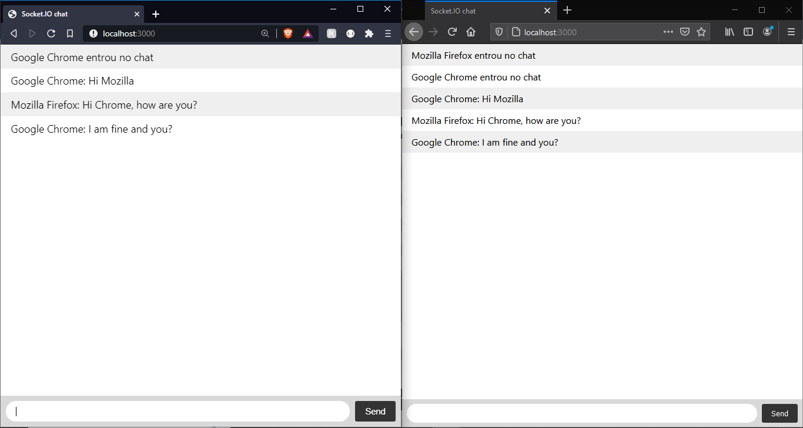

[](https://nodejs.org)[](https://socket.io/)

# Example chat socket.io (chats-socketio-nodejs)

## Print
<div style="width: 100% auto; text-align:center;">
  
</div>

## Install the dependencies
```bash
npm install
```

### Start the project
```bash
npm start
```
